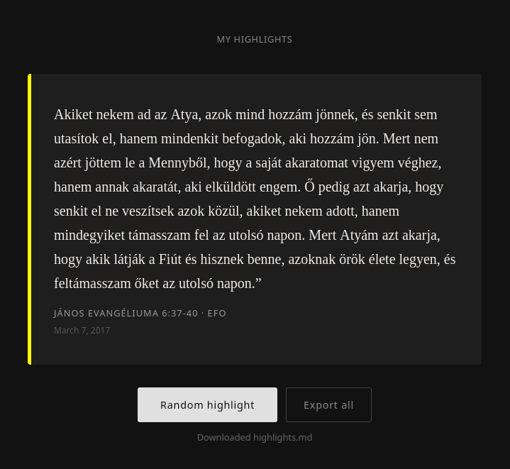

# bible-highlight

A personal web app that surfaces random Bible verse highlights from your [YouVersion](https://www.bible.com) account.



## How it works

It works by spoofing Android app headers to access YouVersion's internal mobile API, then extracts verse text from the `__NEXT_DATA__` JSON that Next.js embeds in bible.com pages. Displays a random highlight each time you click the button, preserving the original highlight color as a card accent.

## Setup

1. Go to [bible.com](https://www.bible.com) and sign in
2. Open DevTools → Application → Cookies → `www.bible.com`
3. Copy the value of the `yva` cookie
4. Create a `.env` file:

```env
YVA_TOKEN=your_yva_cookie_value
PORT=8080
```

5. Run:

```sh
go run .
```

Then open [http://localhost:8080](http://localhost:8080).

## Export

All highlights can be exported as a Markdown file via `/api/export`.

## Token refresh

The `yva` cookie expires periodically. When it does, go to `/refresh` and paste a new one.
